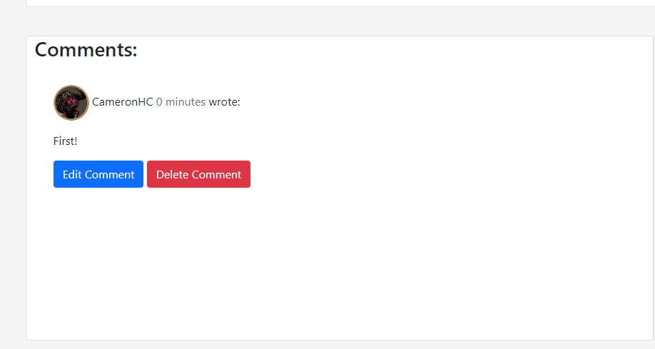
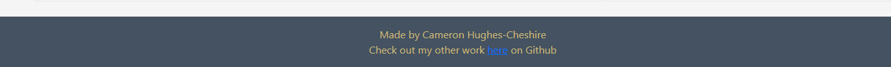

# The Hobby Corner 
 
The Hobby Corner is a blog webiste for my interests: On there, as a superuser, I can make posts about topics that I like and autheticated users can contact me and comment and like posts as well. It's overall quite simple in it's design but the website works to be what I want it to be, a blog for myself. 

## Features 

### Existing Features

- __Navigation Bar__

  There's a nav bar at the top of the screen to got to the different screens, so from here you can go to the homepage, sort out accounts and, once autheticated, contact me as well

- __The blog posts__

  From here you can see all the different blog posts that have been made, I add these posts manually through Django Admin. The posts have the image as the masthead as well as the image showing on the posts itself. From here, you can see the likes and comments on a post as well. 

- __Login Page__
  This is where users who have made an account can sign in and from there they can comment on posts, like posts and will have the option to contact me as well. 
 

- __Register page__

  Before the user can login, they must register and sign up to the website. They will have to enter a username and secure password. 

- __Logout__

  If the user wants, they also have the option to sign out of their account too.

- __A Blog Post__

  So here is a blog post itself: The title and image are held within a masthead at the top and the body of the blog itself is below. If an image wasn't selected, it would default to a standard image.

- __Blog Comments__ 

  Here is where users can see their comments and other people's comments, as well as how long ago they were posted. They can also edit them and delete them from here as well. To make a comment a user must be signed in on their account. 

- __Make a comment__

  From here, authenticated users can post comments on a post but these need to be approved by a superuser in Django Admin before they will be visible on the site. 

-__Footer__ 

  This is the footer for the site, from here you can access my Github from the highlighted link

## Testing 

  So there were several things I tested during the making of this 