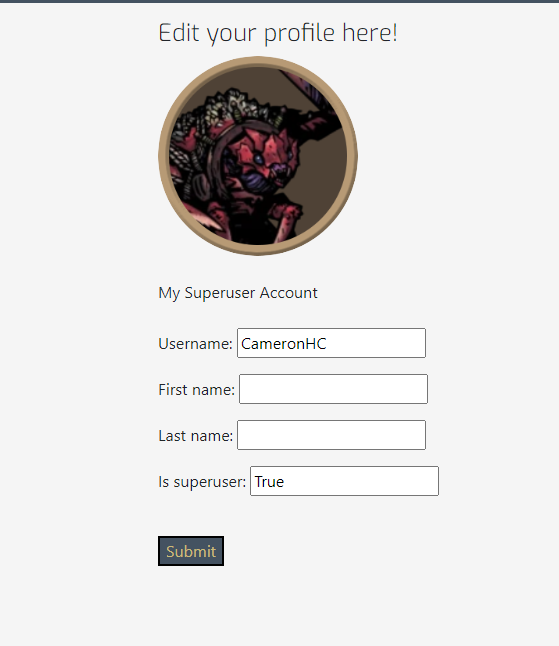
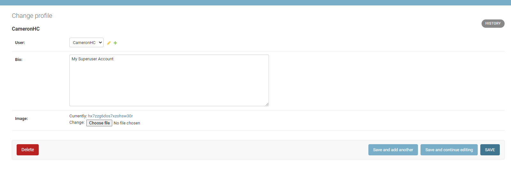
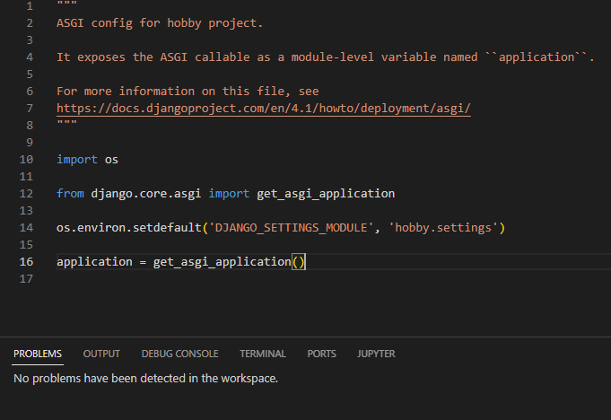

# The Hobby Corner 
 
The Hobby Corner is a blog webiste for my interests: On there, as a superuser, I can make posts about topics that I like and autheticated users can contact me and comment and like posts as well. It's overall quite simple in it's design but the website works to be what I want it to be, a blog for myself. 

## Features 

### Existing Features

- __Navigation Bar__

  There's a nav bar at the top of the screen to got to the different screens, so from here you can go to the homepage, sort out accounts and, once autheticated, contact me as well

- __The blog posts__

  From here you can see all the different blog posts that have been made, I add these posts manually through Django Admin. The posts have the image as the masthead as well as the image showing on the posts itself. From here, you can see the likes and comments on a post as well. 

- __Login Page__
  This is where users who have made an account can sign in and from there they can comment on posts, like posts and will have the option to contact me as well. 
 

- __Register page__

  Before the user can login, they must register and sign up to the website. They will have to enter a username and secure password. 

- __Logout__

  If the user wants, they also have the option to sign out of their account too.

- __A Blog Post__

  So here is a blog post itself: The title and image are held within a masthead at the top and the body of the blog itself is below. If an image wasn't selected, it would default to a standard image.

- __Blog Comments__ 

  Here is where users can see their comments and other people's comments, as well as how long ago they were posted. They can also edit them and delete them from here as well. To make a comment a user must be signed in on their account. 

-__Edit Profile__

  Here is where the user can edit their profile if they so wish, they can add a name to their profile as well as make themselves a superuser if they wanted to as well. 

- __Make a comment__

  From here, authenticated users can post comments on a post but these need to be approved by a superuser in Django Admin before they will be visible on the site. 

-__Footer__ 

  This is the footer for the site, from here you can access my Github from the highlighted link

## Testing 

  So there were several things I tested during the making of this project; Responsiveness, homepage design and emails were the main things I needed to test to make sure they were working. Responsiveness was quite an easy one as Bootstrap covered most of this for me however I still needed to test everything was okay for smaller devices but some of the changes tied into the homepage design. The homepage design was initially an issue as different sized images would cause the cards on the homepage to be different sizes as well. When there are four or more posts on a page, it will paginate underneath and this design as is would leave large spaces between the posts if they were vastly different sizes. 
  
  

  The simplest way I found to fix this was to set the card and the image to certain height in css, 600px and 400px respectively. This made it so that all the cards on the homepage would be in line and this layout works on mobile as well, displaying neatly on smaller screens as well. This also eliminates the large white spaces between the posts when the page paginates as well although I did have to add in some margins to keep some space between them. 

  

  Now emails are another issue I have on the site: I wanted to give users the opportunity to email me about topics that they wanted to ask/talk to me about. However I had had several issues with this, between needing to hide the SMTP settings and also having several errors when trying to send the emails as well. I was getting this error when sending emails from the contact page. 

  

  The feature to send emails was ultimately scrapped due to adding it too late to the project and the problems I ran into I couldn't easily solve. The error I believe was down to the port being blocked but, whether testing on Gitpod or Heroku, the emails wouldn't send either way. This would be something I'd like to come back to in the future instead though. Django does have the functionality for it so it is doable however I'd need to iron out the issues before I can implement it on to a blog website.

## Data Models 

  I had several data models for this project: Post, Comment and Profile. 

  Post: This data model was used for actually making the posts on the website itself; it consisted of a Title, Author, Slug, Content, Image and Status. These would all display to the frontend, bar status. The Title would be visible on the homepage as well as the post itself, the slug would work as secondary, more in-depth headline but wasn't necessary for a post. The content was the main body of text and the image would be displayed on the homepage as well in the masthead of the post. The Status was used for the backend and would determine whether a post would be displayed or not. 

  

  Comment: A data model for comments was also made, this would allow users to post comments on to posts but these comments must be approved first. These comments would be tied to a post and would need a user to be authenticated to make comments as well. Comments show the users name on it and the body is a TextField for showing the actual comment itself as well. The created_on field is there to allow people to see when the comment was made as it will show how long ago it was posted. Before comments are posted, they need to approved with Django admin by a superuser. 

  

  Profile: This data model allows superusers to create profiles or add profiles to existing users. This profile will have a name tied to it as well as a body text that works as a bio for the user. 

  

 ### Agile methodology

 For the Agile Methodology, I used the project board on github to plan out my project. For this, I had selected issues and moved them across to the corresponding column when they either being started, worked on or had been completed. I marked each of these as issues and also added comments to them were appropriate as well. Once these were added to the done section, I would mark these issues as closed as well. 

 
 

### Validator Testing 

  Code Validation:
  To ensure all code for Gamernetic was correct, validation through various validators was performed. The results are listed below.

  HTML:
  Homepage: 

  

  Login:

  

  Logout:

   

  Register:

   

  Post:

   

  Edit Profile: 

   

   CSS:

   

  Python: 

  As of me testing this, the PEP8 validator is currently down so I am unable to validate my code throughout. As a workaround, I will use pycodestyle instead using the following method:

  Run the command pip3 install pycodestyle  Note that this extension may already be installed, in which case this command will do nothing.

  In your workspace, press Ctrl+Shift+P (or Cmd+Shift+P on Mac).

  Type the word linter into the search bar that appears, and click on Python: Select Linter from the filtered results (image 1).

  Select pycodestyle from the list (image 2).

  PEP8 errors will now be underlined in red, as well as being listed in the PROBLEMS tab beside your terminal.

  Using this method, here were the results from my validator testing: 

  Admin:

  

  Blog apps: 

  

  Forms:

  

   Models: 

  

  Blog Urls: 

  

  Views:

  

  Settings:

  

  ASGI: 

  

  Hobby-Urls: 

  

  WSGI: 

  

### Languages
   - Python
   - JavaScript
   - HTML5
   - CSS3

### Frameworks, Libraries, Programs
- Python Built-in Modules:
  - [os](https://docs.python.org/3/library/os.html) 

- External Packages
  - [cloudinary](https://pypi.org/project/cloudinary/1.29.0/) 
  - [crispy-bootstrap5](https://pypi.org/project/crispy-bootstrap5/0.6/) 
  - [dj-database-url](https://pypi.org/project/dj-database-url/0.5.0/) 
  - [dj3-cloudinary-storage](https://pypi.org/project/dj3-cloudinary-storage/0.0.6/) 
  - [Django](https://pypi.org/project/Django/3.2.14/) 
  - [django-allauth](https://pypi.org/project/django-allauth/0.51.0/)
  - [django-crispy-forms](https://pypi.org/project/django-crispy-forms/1.14.0/) 
  - [gunicorn](https://pypi.org/project/gunicorn/20.1.0/)
  - [psycopg2](https://pypi.org/project/psycopg2/2.9.3/) 

### Programs & Tools

- [Google Fonts:](https://fonts.google.com/)
  - Was used to to incorporate font styles.  
- [Bootstrap](https://getbootstrap.com/)
  - Was used to create the front-end design.
- [GitPod:](https://gitpod.io/)
  - Gitpod was used as IDE to commit and push the project to GitHub.
- [GitHub:](https://github.com/)
  - Was used for all storing and backup of the code pertaining to the project.
  ## Deployment

### Forking the GitHub Repository
1. Go to [the project repository](hhttps://github.com/CHCheshire/Project-blog)
2. In the right most top menu, click the "Fork" button.
3. There will now be a copy of the repository in your own GitHub account.

### Running the project locally
1. Go to [the project repository](https://github.com/CHCheshire/Project-blog)
2. Click on the "Code" button.
3. Choose one of the three options (HTTPS, SSH or GitHub CLI) and then click copy.
4. Open the terminal in you IDE program. 
5. Type `git clone` and paste the URL that was copied in step 3.
6. Press Enter and the local clone will be created. 

### Alternatively by using Gitpod:
1. Go to [the project repository](https://github.com/CHCheshire/Project-blog)
2. Click the green button that says "Gitpod" and the project will now open up in Gitpod.

### Deploying with Heroku

I followed the below steps using the Code Institute tutorial:

The following command in the Gitpod CLI will create the relevant files needed for Heroku to install your project dependencies `pip3 freeze --local > requirements.txt`. Please note this file should be added to a .gitignore file to prevent the file from being committed.

1. Go to [Heroku.com](https://dashboard.heroku.com/apps) and log in; if you do not already have an account then you will need to create one.
2. Click the `New` dropdown and select `Create New App`.
3. Enter a name for your new project, all Heroku apps need to have a unique name, you will be prompted if you need to change it.
4. Select the region you are working in.

#### Heroku Settings  
You will need to set your Environment Variables - this is a key step to ensuring your application is deployed properly.
1. In the Settings tab, click on `Reveal Config Vars` and set the following variables:
    - Add key: `PORT` & value `8000`
    - Add key: DATABASE_URL, this should have been created automatically by Heroku.
    - Add key: CLOUDINARY_URL and the value as your cloudinary API Environment variable e.g.
    - Add key: SECRET_KEY and the value as a complex string which will be used to provide cryptographic signing.

2. Buildpacks are also required for proper deployment, simply click `Add buildpack` and search for the ones that you require.
    - For this project, I needed to add `Python`.

####  Heroku Deployment  
In the Deploy tab:
1. Connect your Heroku account to your Github Repository following these steps:
    - Click on the `Deploy` tab and choose `Github-Connect to Github`.
    - Enter the GitHub repository name and click on `Search`.
    - Choose the correct repository for your application and click on `Connect`.
2. You can then choose to deploy the project manually or automatically, automatic deployment will generate a new application every time you push a change to Github, whereas manual deployment requires you to push the `Deploy Branch` button whenever you want a change made.
3. Once you have chosen your deployment method and have clicked `Deploy Branch` your application will be built and you should now see the `View` button, click this to open your application.